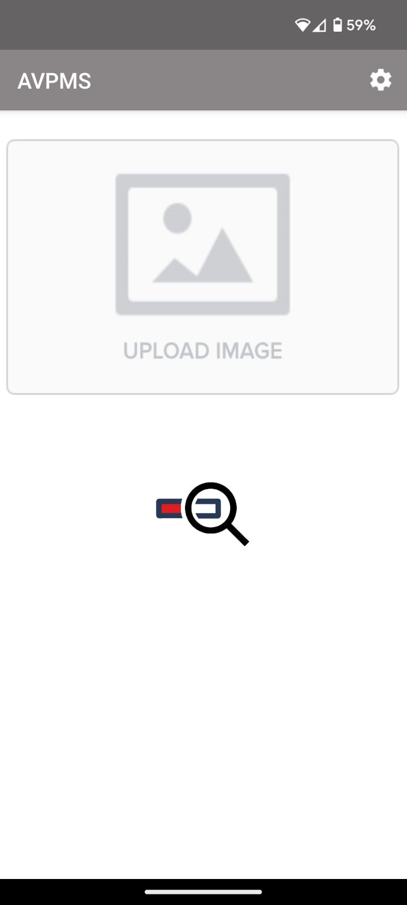
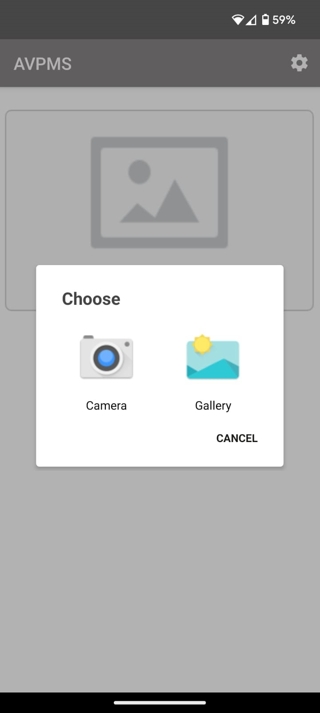
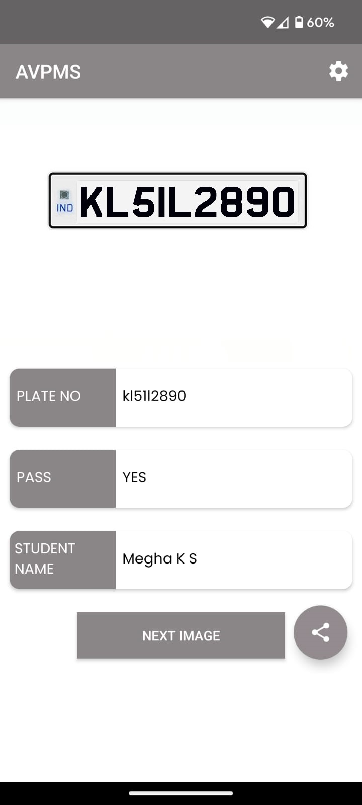

# AVPMS (Automatic Vehicle Pass Management system)

This app is designed for Vehicle Pass Management at a college. Security guards can use the app to scan vehicle number plates and verify if the vehicle is registered in the college's database


## Features
- Capture and scan vehicle number plates using a mobile device or camera.
- Decodes License plate using **OCR**
- Check the scanned number plate against the college's registered vehicle **Database**.
- Display the student's information associated with the registered vehicle.
- Works on **dark, low-res, blurry images** and tough angles, all vehicle types

## Installation and Usage

- **Download** the [APK package](https://github.com/Meghhaah/AVPMS/releases/tag/v1.0).

- Open the app on your device.
- Capture the vehicle's number plate using the camera feature.
- Wait for the app to scan and verify the number plate.
- View the student's information if the vehicle is registered.

## API Token

Get an **API token** from [Plate Recognizer](https://platerecognizer.com/) and put it in the app settings.

Sign up for a [**Free Trial**](https://app.platerecognizer.com/accounts/signup/?utm_source=github&amp;utm_medium=website) now (no credit card required) or **learn more** at [https://platerecognizer.com](https://platerecognizer.com/).

## Screenshots
<div style="display: flex; justify-content: space-between;">
  
  
  
</div>

## Contributing
We welcome contributions to enhance the AVPMS. To contribute:
1. Fork the repository.
2. Create a new branch:
    ```bash
    git checkout -b feature-branch
    ```
3. Make your changes and commit them:
    ```bash
    git commit -m "Add new feature"
    ```
4. Push to the branch:
    ```bash
    git push origin feature-branch
    ```
5. Open a pull request.

## Acknowledgements

 - [ParkPow: The base code used in this project served as a fundamental starting point for the development of our AVPMS. We appreciate the work done by the developers and contributors of this project.](https://github.com/parkpow/alpr-anpr-android)

## Appendix
- You can also build it from source. We recommand using [Android Studio](https://developer.android.com/studio).
